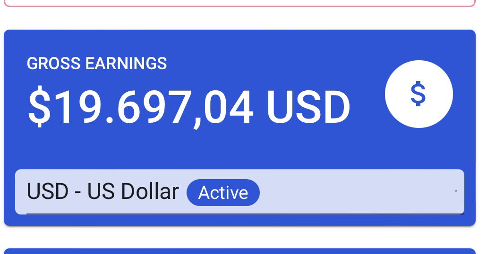
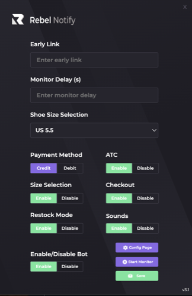

# Rebel Notify


**🌐 Sitio Web**: [rebelnotify.vercel.app](https://rebelnotify.vercel.app/)

## La Historia

Mi primer proyecto masivo y probablemente el que más me enseñó sobre buildear cosas a escala.

Rebel Notify fue el primer cookgroup de Chile. Empezó en 2020 como un bot de Discord que monitoreaba restocks de zapatillas y descuentos en tiendas chilenas. Lo que partió como un experimento personal terminó siendo una comunidad con muchos miembros activos durante 3 años.

El stack era simple pero efectivo: monitores Python corriendo 24/7 en Heroku, webhooks de Discord para notificaciones instantáneas, y una extensión de Chrome para automatizar checkouts. Nada fancy, pero funcionaba.

Cerramos en 2023 cuando el mercado de reventa de sneakers colapsó. Nike cambió sus políticas, el mercado se saturó, y dejó de tener sentido seguir. Así es esto.

Este repo es básicamente un archivo de lo que fue. El código está aquí para cualquiera que quiera ver cómo se construye un servicio de monitoreo a escala, con toda la infraestructura cloud y la automatización detrás.

**2020-2023**

### Revenue Total

Durante los 3 años de operación, Rebel Notify generó ingresos significativos como cookgroup:



---

## Qué Hacía Esto

### Monitores de Restock (SKU Específico)
Monitoreaba productos específicos 24/7. Cuando había stock, notificación instantánea a Discord. Simple y efectivo.

**Sitios:**
- Bold.cl
- Moredrops.cl
- Nike SNKRS Chile

### Monitores Generales
Escaneaba catálogos completos buscando nuevos drops. No necesitabas saber el SKU, el bot encontraba todo lo nuevo.

**Sitios:**
- Bold.cl
- Moredrops.cl
- Descuentosrata.com
- Knasta.cl
- Nike SNKRS Chile

### Chrome Extension
Extensión para hacer checkout más rápido. Guardaba tus datos y llenaba formularios automáticamente. Hecha custom para Bold y Moredrops.



**Actualización 2025**: Migrada a Manifest V3 para funcionar en Chrome moderno. Los sitios probablemente cambiaron, pero la extensión carga correctamente.

---

## Estructura del Proyecto

```
rebelnotify/
├── bold-restock-sku/           # Monitor de restock de Bold.cl (SKU específicos)
├── nike-sku/                   # Monitor de Nike SNKRS Chile (SKU específicos)
├── moredrops-restock-sku/      # Monitor de restock de Moredrops.cl
├── snkrs/                      # Monitor general de Nike SNKRS
├── bold-general/               # Monitor general de Bold.cl
├── moredrops-general/          # Monitor general de Moredrops.cl
├── descuentosrata/             # Monitor de Descuentosrata.com
├── knasta/                     # Monitor de Knasta.cl
└── chrome-extension/           # Extensión de Chrome para autofill
```

Cada carpeta contiene su propio README con instrucciones detalladas de instalación y uso.

---

## Tecnologías Utilizadas

### Backend (Python)
- **requests** - Peticiones HTTP
- **beautifulsoup4** - Web scraping HTML
- **discord_webhook** - Notificaciones Discord
- **sqlalchemy** - ORM para bases de datos
- **helheim** - Solución de Cloudflare challenges
- **cloudscraper** - Bypass anti-bot
- **random_user_agent** - Rotación de User-Agents
- **python-dotenv** - Gestión de variables de entorno

### Frontend (Chrome Extension)
- JavaScript vanilla
- Chrome Storage API
- Chrome Content Scripts
- Discord OAuth 2.0

---

## Setup

Si quieres correr esto localmente:

1. Clona el repo
```bash
git clone https://github.com/srdanirz/rebelnotify.git
cd rebelnotify
```

2. Instala dependencias
```bash
cd [carpeta-del-monitor]
pip install -r requirements.txt
```

3. Configura tu `.env`
```env
WEBHOOK=tu_webhook_de_discord
USERNAME=Rebel Notify
COLOUR=16777215
KEYWORDS=jordan%dunk%yeezy
DELAY=3.0
```

4. Corre el monitor
```bash
python bot.py
```

Cada carpeta tiene su propio README con instrucciones específicas.

---

## Monitores Disponibles

### 1. Monitor de Bold Restock (SKU)
Monitorea productos específicos en Bold.cl por SKU/PID.

**[Ver README completo →](./bold-restock-sku/README.md)**

### 2. Monitor de Moredrops Restock (SKU)
Monitorea productos específicos en Moredrops.cl por SKU.

**[Ver README completo →](./moredrops-restock-sku/README.md)**

### 3. Monitor de Nike SKU
Monitoreo avanzado de Nike SNKRS con bypass de Cloudflare.

**[Ver README completo →](./nike-sku/README.md)**

### 4. Monitor General de Bold
Detecta automáticamente nuevos productos en Bold.cl sin SKU específico.

**[Ver README completo →](./bold-general/README.md)**

### 5. Monitor General de Moredrops
Detecta automáticamente nuevos productos en Moredrops.cl.

**[Ver README completo →](./moredrops-general/README.md)**

### 6. Monitor de SNKRS
Monitor general de Nike SNKRS Chile con información detallada de releases.

**[Ver README completo →](./snkrs/README.md)**

### 7. Monitor de Descuentosrata
Detecta descuentos en Descuentosrata.com.

**[Ver README completo →](./descuentosrata/README.md)**

### 8. Monitor de Knasta
Detecta descuentos en Knasta.cl.

**[Ver README completo →](./knasta/README.md)**

### 9. Chrome Extension
Extensión de Chrome para autofill automático de checkout.

**[Ver README completo →](./chrome-extension/README.md)**

---

## Cómo Funcionaba

Los monitores corrían en loops infinitos cada 3-5 segundos. Scrapeaban las tiendas, comparaban con lo que tenían guardado en SQLite, y si había algo nuevo mandaban webhook a Discord con toda la info: nombre, precio, imagen, link, tallas.

La extensión de Chrome completaba formularios de checkout automáticamente. Nada más.

---

## Arquitectura

### El Stack

Todo corriendo en la nube para tener uptime 24/7:

- **Heroku** - Worker dynos para los monitores Python
- **Discord** - Notificaciones y comunidad
- **SQLite/Postgres** - Tracking de productos y prevención de duplicados
- **SmartProxy** - Proxies rotativos para no comerse bans
- **Heroku (custom)** - Servicio OAuth para la extensión de Chrome

### Diagrama de Arquitectura

```
┌─────────────────────────────────────────────────────────────────┐
│                    REBEL NOTIFY ARCHITECTURE                     │
└─────────────────────────────────────────────────────────────────┘

┌────────────────────────────────────────────────────────────────┐
│                          HEROKU CLOUD                          │
│  ┌──────────────────────────────────────────────────────────┐ │
│  │           Worker Dynos (Monitores Python)                │ │
│  │  ┌─────────────────────────────────────────────────┐     │ │
│  │  │  • Bold Restock SKU        • SNKRS General      │     │ │
│  │  │  • Moredrops Restock SKU   • Descuentosrata     │     │ │
│  │  │  • Nike SKU Monitor        • Knasta Monitor     │     │ │
│  │  │  • Bold General            • Moredrops General  │     │ │
│  │  └─────────────────────────────────────────────────┘     │ │
│  │                          ↓                                │ │
│  │  ┌─────────────────────────────────────────────────┐     │ │
│  │  │        Heroku Postgres (opcional)               │     │ │
│  │  │  • Tracking de productos notificados            │     │ │
│  │  │  • Prevención de duplicados                     │     │ │
│  │  │  • Logs históricos                              │     │ │
│  │  └─────────────────────────────────────────────────┘     │ │
│  └──────────────────────────────────────────────────────────┘ │
└────────────────────────────────────────────────────────────────┘
                              ↓
┌────────────────────────────────────────────────────────────────┐
│                      SMARTPROXY SERVICE                        │
│  • Proxies rotativos para evitar bans                         │
│  • Datacenter proxies (dc.smartproxy.com)                     │
│  • Pool de 100 proxies simultáneos                            │
└────────────────────────────────────────────────────────────────┘
                              ↓
┌────────────────────────────────────────────────────────────────┐
│                    SITIOS WEB MONITOREADOS                     │
│  • Bold.cl            • Moredrops.cl                          │
│  • Nike SNKRS CL      • Descuentosrata.com                    │
│  • Knasta.cl                                                  │
└────────────────────────────────────────────────────────────────┘
                              ↓
┌────────────────────────────────────────────────────────────────┐
│                      DISCORD WEBHOOKS                          │
│  • Notificaciones embed                                       │
│  • Canales dedicados por tipo de producto                     │
│  • Menciones @everyone para drops importantes                 │
│  • Imágenes, precios, links de compra                         │
└────────────────────────────────────────────────────────────────┘
                              ↓
┌────────────────────────────────────────────────────────────────┐
│                    COMUNIDAD DISCORD                           │
│  • Servidor privado con comunidad activa                      │
│  • Canales de notificaciones                                  │
│  • Chat de comunidad                                          │
│  • Soporte técnico                                            │
└────────────────────────────────────────────────────────────────┘
                              ↓
┌────────────────────────────────────────────────────────────────┐
│               CHROME EXTENSION (Cliente Local)                 │
│  ┌──────────────────────────────────────────────────────────┐ │
│  │  • Autofill de checkout (Bold, Moredrops)               │ │
│  │  • OAuth con Discord (via Lonthentication/Heroku)       │ │
│  │  • Shortcuts personalizados                             │ │
│  │  • Almacenamiento local de credenciales                 │ │
│  └──────────────────────────────────────────────────────────┘ │
└────────────────────────────────────────────────────────────────┘
```

### Stack Tecnológico Completo

**Backend:**
- Python 3.8+
- Heroku Worker Dynos (24/7 uptime)
- Heroku Postgres (Base de datos SQLite local alternativa)
- SmartProxy (Proxies rotativos)

**Web Scraping:**
- requests + BeautifulSoup4 (HTML parsing)
- cloudscraper (Cloudflare bypass)
- helheim (Solución avanzada de Cloudflare challenges)

**Notificaciones:**
- Discord Webhooks
- Discord Bot API (opcional)

**Frontend:**
- Chrome Extension (Manifest V2)
- JavaScript vanilla
- Discord OAuth 2.0
- Lonthentication (Heroku) - Servidor OAuth personalizado

**DevOps:**
- Git/GitHub (Control de versiones)
- Heroku CLI (Deployment)
- dotenv (Gestión de secretos)

### Deploy en Heroku

Los monitores corrían como worker dynos. Básicamente:

```
worker: python bot.py
```

Deploy era simple:
```bash
heroku create rebel-notify-bold
heroku config:set WEBHOOK="https://discord.com/api/webhooks/..."
git push heroku main
heroku ps:scale worker=1
```

Si el bot se caía, Heroku lo reiniciaba automáticamente. Logs centralizados para debuggear cuando algo se rompía a las 3am.

---

## Lo Que Aprendí

Este fue mi primer proyecto masivo. Me enseñó a buildear cosas que tienen que funcionar 24/7, gestionar una comunidad grande, y debuggear a las 3am cuando un monitor se caía justo antes de un drop importante.

Gracias a todos los que fueron parte de Rebel Notify.

---

## Licencia

MIT License. El código está aquí para cualquiera que quiera aprender o reutilizar partes.

**Nota**: Los monitores y la extensión probablemente ya no funcionen. Han pasado 2-3 años y los sitios cambiaron sus estructuras. Este repo es solo referencia histórica del proyecto.

---

**Hecho en Chile 🇨🇱 | 2020-2023**
